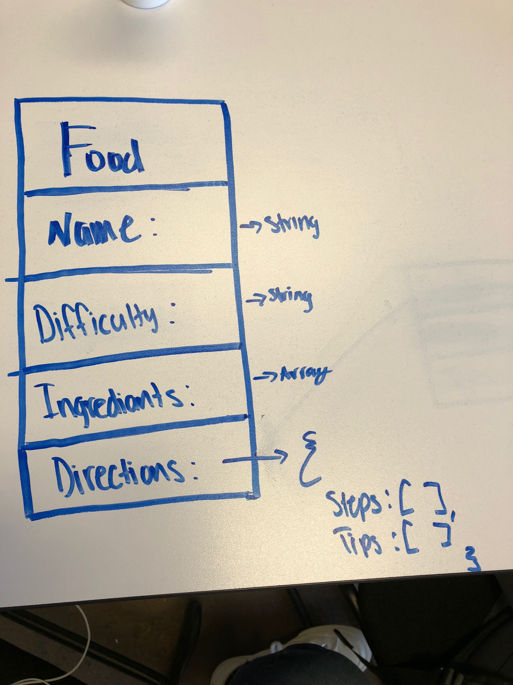

# Cooking React
Final Project: Aleena Madni
 

 
## Deployed Link:
[Cooking-Blog](https://cooking-blog-56a96.firebaseapp.com/)
## Description:
A cooking blog built by React.js and using Firebase as a backend!
The user can add/edit recipes by making an ingredients list and have step by step directions. Recipes can also be deleted if they aren't used as much as the other recipes.

## Additions for the Final Project:
* Functional update to complete CRUD
* Add a comment section
* Log in with google auth

## WireFrame:

 
A more detailed Wire Frame:
 

## Database ERD (Entity Relationship Diagram):

## Trello:
Trello contains to-do's and User Stories for MVP.
 
[Trello](https://trello.com/invite/b/dU2MXJQd/d6141a3a221cead35d45271eaecdea12/cookin-react)
