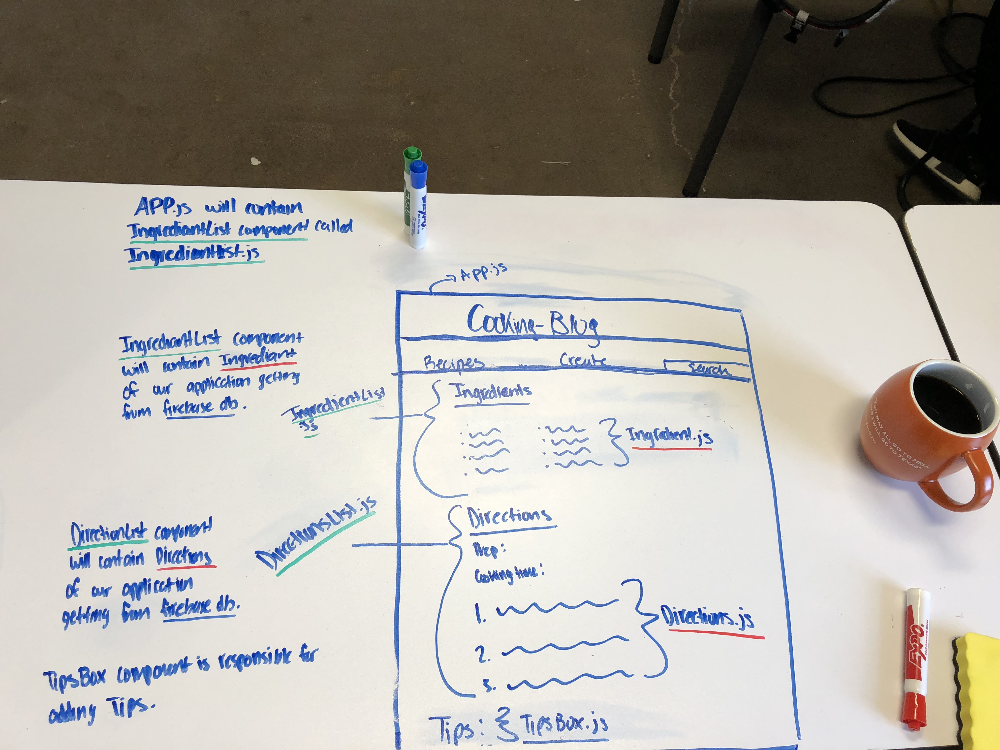

# Cooking React
Project 3: Aleena Madni
 

 
## Description:
A cooking blog built by react and using firebase as a backend!
The user can add/edit recipes, delete it,  
## WireFrame:

 
A more detailed Wire Frame:
 

## Database ERD (Entity Relationship Diagram):

## Trello:
